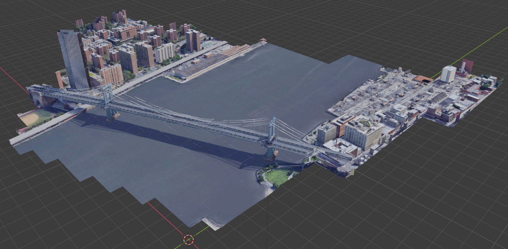

MapsModelsImporter samples
==========================

This is a set of .rdc files that you can try to import to check your installation of [MapsModelsImporter](https://github.com/eliemichel/MapsModelsImporter).

- **Samples made with RenderDoc Version 1.11:** does not work for now (newest Version is 0.3.3)
  - [Granada, Alhambra](#granada-alhambra)

- **Samples made with RenderDoc Version 1.10:** Works with MapsModelImporter Version: 0.3.3
	- [Pumpa.rdc](#samples/Pumpa.rdc)
	- [Funkhaus.rdc](#samples/Funkhaus.rdc)
	- [Tracey.rdc](#samples/Tracey.rdc)
	- [HongKong.rdc](#samples/HongKong.rdc)
	- [Mine.rdc](#samples/Mine.rdc)
	- [Shizuoka.rdc](#samples/Shizuoka.rdc)
	- [New York, Manhattan Bridge 1.10](#new-york-manhattan-bridge-110)

- **Samples made with RenderDoc Version 1.9:** Works with MapsModelImporter Version: <= 0.3.3
  - [New York, Manhattan Bridge 1.9](#new-york-manhattan-bridge-19)

 ***
 ***

## Samples made with RenderDoc Version 1.11

### Granada, Alhambra
<!-- make sure to have two whitespaces at the end of each line to make a new line on GitHub -->
File: [alhambra-RD_1.11.rdc](samples/alhambra-RD_1.11.rdc)  
RenderDoc Version: 1.11  
Capture Source: Google Maps  
File size: 45 MB  
Capture date: *2020-11-30*  
<!--  -->

 ***

## Samples made with RenderDoc Version 1.10

### Pumpa
<!-- make sure to have two whitespaces at the end of each line to make a new line on GitHub -->
File: [Pumpa.rdc](samples/Pumpa.rdc)  
RenderDoc Version: 1.10  
Capture Source: ?  
File size: 31 MB  
Capture date: *2020-11-28*  

 ***

### Funkhaus
<!-- make sure to have two whitespaces at the end of each line to make a new line on GitHub -->
File: [Funkhaus.rdc](samples/Funkhaus.rdc)  
RenderDoc Version: 1.10  
Capture Source: ?  
File size: 31 MB  
Capture date: *2020-11-28*  

 ***

### Tracey
<!-- make sure to have two whitespaces at the end of each line to make a new line on GitHub -->
File: [Tracey.rdc](samples/Tracey.rdc)  
RenderDoc Version: 1.10   
Capture Source: ?  
File size: 52 MB  
Capture date: *2020-11-28*  

 ***

### HongKong
<!-- make sure to have two whitespaces at the end of each line to make a new line on GitHub -->
File: [HongKong.rdc](samples/HongKong.rdc)  
RenderDoc Version: 1.10  
Capture Source: ?  
File size: 72 MB  
Capture date: *2020-11-28*  

 ***

### Mine
<!-- make sure to have two whitespaces at the end of each line to make a new line on GitHub -->
File: [Mine.rdc](samples/Mine.rdc)  
RenderDoc Version: 1.10  
Capture Source: ?  
File size: 68 MB  
Capture date: *2020-11-28*  

 ***

### Shizuoka
<!-- make sure to have two whitespaces at the end of each line to make a new line on GitHub -->
File: [Shizuoka.rdc](samples/Shizuoka.rdc)  
RenderDoc Version: 1.10  
Capture Source: ?  
File size: 68 MB  
Capture date: *2020-11-28*  

 ***

### New York, Manhattan Bridge 1.10
<!-- make sure to have two whitespaces at the end of each line to make a new line on GitHub -->
File: [bridge-RD_1.10](samples/bridge-RD_1.10.rdc)  
RenderDoc Version: 1.10  
Capture Source: Google Maps  
File size: 26 MB  
Capture date: *2020-11-13*  

 ***

## Samples made with RenderDoc Version 1.9

### New York, Manhattan Bridge 1.9
<!-- make sure to have two whitespaces at the end of each line to make a new line on GitHub -->
File: [bridge-RD_1.9](samples/bridge-RD_1.9.rdc)  
RenderDoc Version: 1.9  
Capture Source: Google Maps  
File size: 30 MB  
Capture date: *2020-11-15*  

 ***

