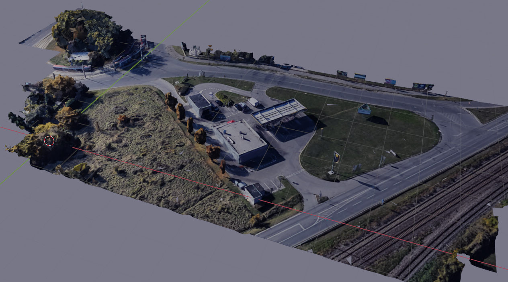
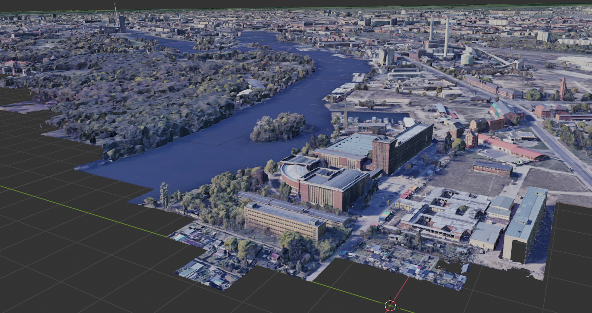
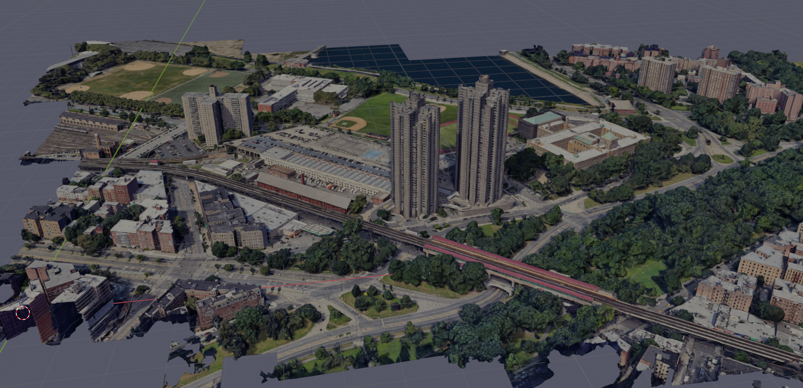
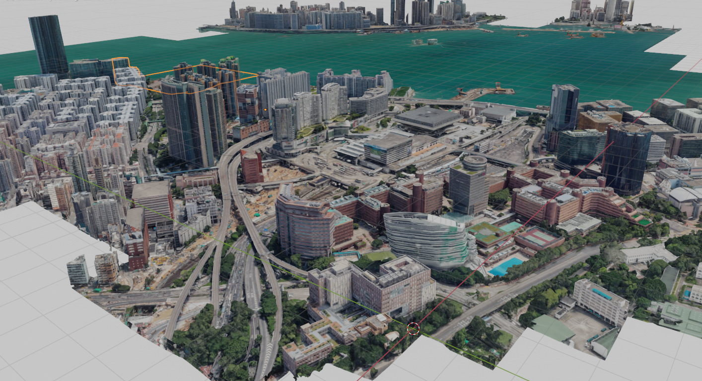
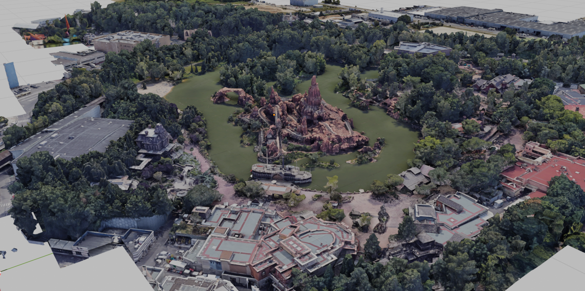
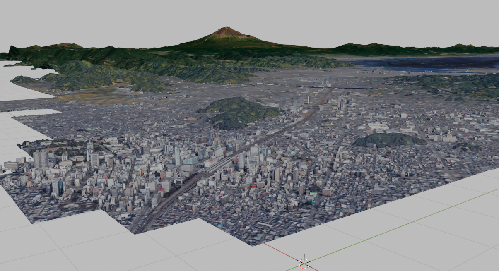
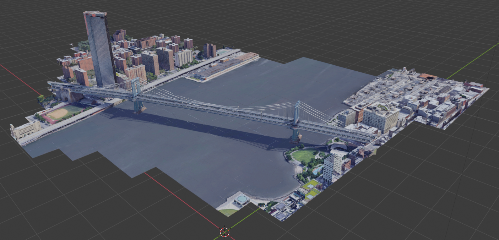

MapsModelsImporter samples
==========================

This is a set of .rdc files that you can try to import to check your installation of [MapsModelsImporter](https://github.com/eliemichel/MapsModelsImporter).

## Samples made with RenderDoc Version 1.10:

## Samples made with RenderDoc Version 1.9:
- [New York, Manhattan Bridge](#new-york-manhattan-bridge)

[Pumpa.rdc](samples/Pumpa.rdc) -- *2020-11-28*

 ***

[Funkhaus.rdc](samples/Funkhaus.rdc) -- *2020-11-28*

 ***

[Tracey.rdc](samples/Tracey.rdc) -- *2020-11-28*

 ***

[HongKong.rdc](samples/HongKong.rdc) -- *2020-11-28*

 ***

[Mine.rdc](samples/Mine.rdc) -- *2020-11-28*

 ***

[Shizuoka.rdc](samples/Shizuoka.rdc) -- *2020-11-28*

 ***

## New York, Manhattan Bridge
File: [bridge (RD_1.9)](samples/bridge-RD_1.9.rdc)
RenderDoc Version: 1.9
capture date: *2020-11-15*

 ***

