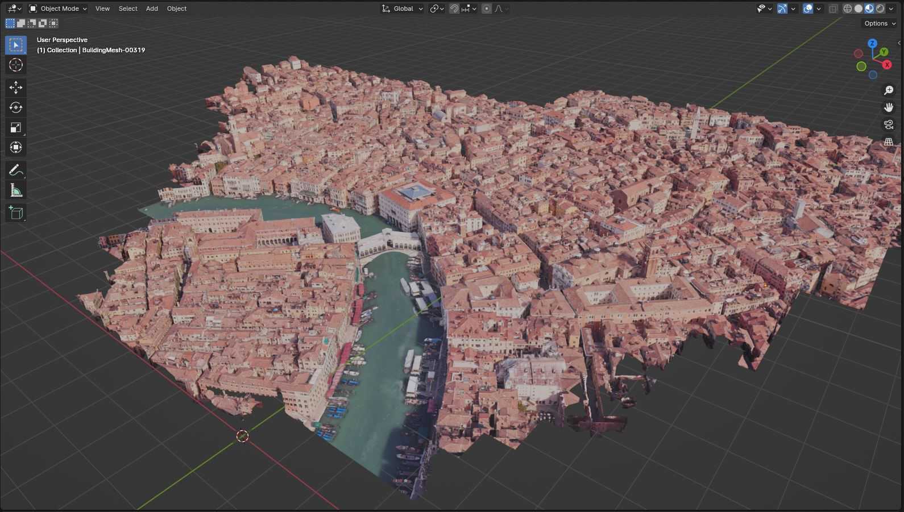
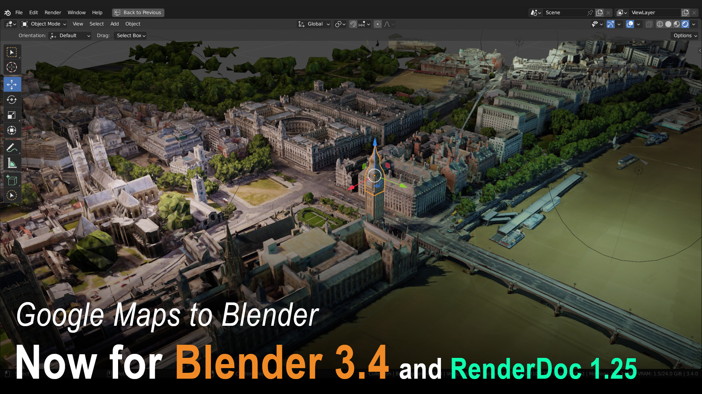
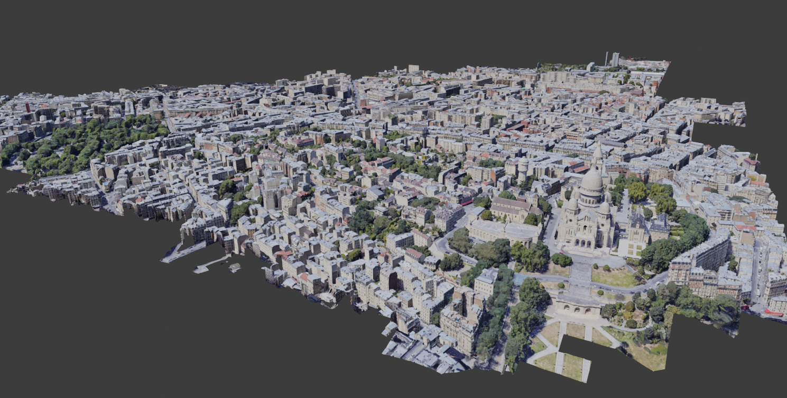
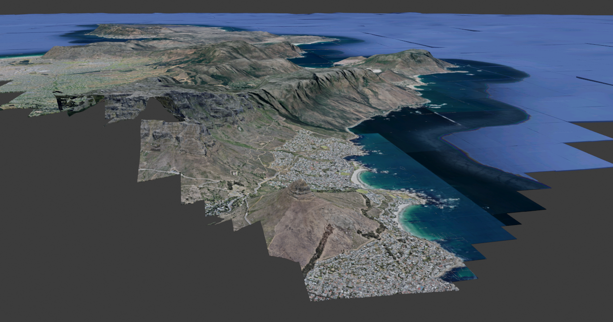
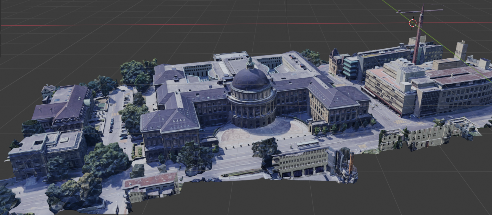

MapsModelsImporter samples
==========================

This is a set of .rdc files that you can try to import to check your installation of [MapsModelsImporter](https://github.com/eliemichel/MapsModelsImporter).

**Please make sure** that you are using the recommended RenderDoc version! Each release of the add-on comes with a **very specific** version of RenderDoc and will only work for this version.

Before opening a new Issue on GitHub please download a sample file to check if this works on your Computer.  
Please be patient. If there's no error message it most probably is still loading.  
Depending on the size of the sample file it may take a minute or two to load and Blender will get unresponsive during this time.  

If it works with a sample file you most probably shouldn't open a new issue on GitHub but figure out how to use RenderDoc.
Find instructions about using RenderDoc by searching [YouTube](https://www.youtube.com/results?search_query=RenderDoc)

- **Samples made with RenderDoc Version 1.31:**
    - [Venise.rdc](#samples/Venise-131.rdc)
- **Samples made with RenderDoc Version 1.25:**
    - [BigBen.rdc](#samples/BigBen-125.rdc)
- **Samples made with RenderDoc Version 1.13:**
    - [SacreCoeur.rdc](#samples/SacreCoeur-113.rdc)
    - [CapeTown.rdc](#samples/CapeTown-113.rdc)
- **Samples made with RenderDoc Version 1.10:**
	- [Pumpa.rdc](#samples/Pumpa.rdc)
	- [Funkhaus.rdc](#samples/Funkhaus.rdc)
	- [Tracey.rdc](#samples/Tracey.rdc)
	- [HongKong.rdc](#samples/HongKong.rdc)
	- [Mine.rdc](#samples/Mine.rdc)
	- [Shizuoka.rdc](#samples/Shizuoka.rdc)
	- [New York, Manhattan Bridge 1.10](#new-york-manhattan-bridge-110)
- **Samples made with RenderDoc Version 1.9:**
  - [New York, Manhattan Bridge 1.9](#new-york-manhattan-bridge-19)
  - [Zürich, ETH](#zürich-eth)
 ***

## Samples made with RenderDoc Version 1.25

### Venise 1.31
<!-- make sure to have two whitespaces at the end of each line to make a new line on GitHub -->
File: [venise-RD_1.31](samples/venise-RD_1.31.rdc)  
RenderDoc Version: 1.31  
Capture Source: Google Maps  
File size: 55 MB  
Capture date: *2024-04-05*  

 ***

## Samples made with RenderDoc Version 1.25

### Big Ben 1.25
<!-- make sure to have two whitespaces at the end of each line to make a new line on GitHub -->
File: [bigben-RD_1.25](samples/bigben-RD_1.25.rdc)  
RenderDoc Version: 1.25  
Capture Source: Google Maps  
File size: 39 MB  
Capture date: *2023-02-02*  

 ***

## Samples made with RenderDoc Version 1.13

### Sacré Coeur 1.13
<!-- make sure to have two whitespaces at the end of each line to make a new line on GitHub -->
File: [SacreCoeur-RD_1.13](samples/SacreCoeur-RD_1.13.rdc)  
RenderDoc Version: 1.13  
Capture Source: Google Maps  
File size: 75 MB  
Capture date: *2021-06-24*  

 ***

### Cape Town 1.13
<!-- make sure to have two whitespaces at the end of each line to make a new line on GitHub -->
File: [CapeTown-RD_1.13](samples/CapeTown-RD_1.13.rdc)  
RenderDoc Version: 1.13  
Capture Source: Google Maps  
File size: 58 MB  
Capture date: *2021-06-24*  

 ***

## Samples made with RenderDoc Version 1.10

### Pumpa
<!-- make sure to have two whitespaces at the end of each line to make a new line on GitHub -->
File: [Pumpa.rdc](samples/Pumpa.rdc)  
RenderDoc Version: 1.10  
Capture Source: Google Maps  
File size: 31 MB  
Capture date: *2020-11-28*  

 ***

### Funkhaus
<!-- make sure to have two whitespaces at the end of each line to make a new line on GitHub -->
File: [Funkhaus.rdc](samples/Funkhaus.rdc)  
RenderDoc Version: 1.10  
Capture Source: Google Maps  
File size: 68 MB  
Capture date: *2020-11-28*  

 ***

### Tracey
<!-- make sure to have two whitespaces at the end of each line to make a new line on GitHub -->
File: [Tracey.rdc](samples/Tracey.rdc)  
RenderDoc Version: 1.10   
Capture Source: Google Maps  
File size: 52 MB  
Capture date: *2020-11-28*  

 ***

### HongKong
<!-- make sure to have two whitespaces at the end of each line to make a new line on GitHub -->
File: [HongKong.rdc](samples/HongKong.rdc)  
RenderDoc Version: 1.10  
Capture Source: Google Maps  
File size: 72 MB  
Capture date: *2020-11-28*  

 ***

### Mine
<!-- make sure to have two whitespaces at the end of each line to make a new line on GitHub -->
File: [Mine.rdc](samples/Mine.rdc)  
RenderDoc Version: 1.10  
Capture Source: Google Maps  
File size: 67 MB  
Capture date: *2020-11-28*  

 ***

### Shizuoka
<!-- make sure to have two whitespaces at the end of each line to make a new line on GitHub -->
File: [Shizuoka.rdc](samples/Shizuoka.rdc)  
RenderDoc Version: 1.10  
Capture Source: Google Maps  
File size: 67 MB  
Capture date: *2020-11-28*  

 ***

### New York, Manhattan Bridge 1.10
<!-- make sure to have two whitespaces at the end of each line to make a new line on GitHub -->
File: [bridge-RD_1.10](samples/bridge-RD_1.10.rdc)  
RenderDoc Version: 1.10  
Capture Source: Google Maps  
File size: 25 MB  
Capture date: *2020-11-13*  

 ***

## Samples made with RenderDoc Version 1.9

### New York, Manhattan Bridge 1.9
<!-- make sure to have two whitespaces at the end of each line to make a new line on GitHub -->
File: [bridge-RD_1.9](samples/bridge-RD_1.9.rdc)  
RenderDoc Version: 1.9  
Capture Source: Google Maps  
File size: 29 MB  
Capture date: *2020-11-15*  

 ***

### Zürich, ETH
<!-- make sure to have two whitespaces at the end of each line to make a new line on GitHub -->
File: [eth-RD_1.9](samples/eth-RD_1.9.rdc)  
RenderDoc Version: 1.9  
Capture Source: Google Maps  
File size: 37 MB  
Capture date: *2020-11-30*  

 ***

